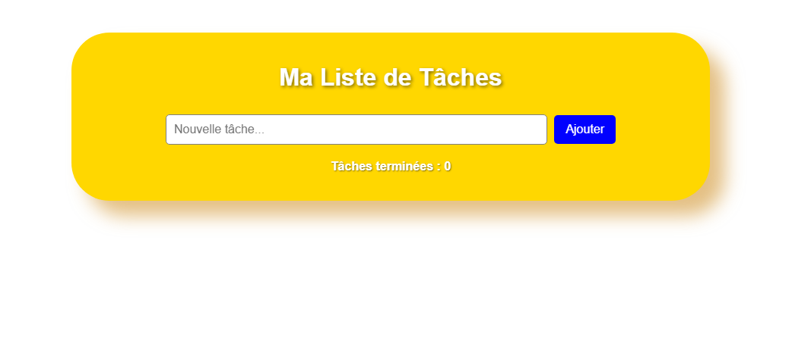
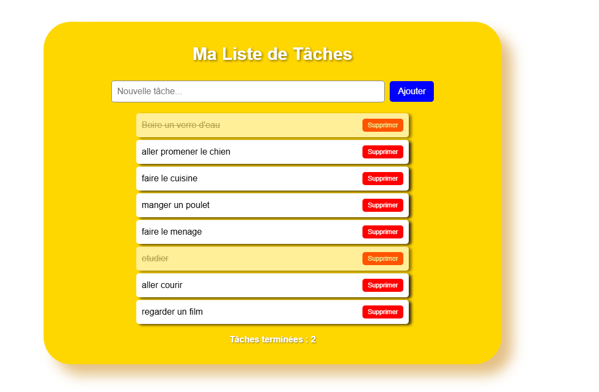

# 📋 CORRECTION - Exercice Liste de tâches

Salut ! J'ai testé ton travail et il y a un GROS problème : **ton app ne marche même pas !**

---

## 🚨 PROBLÈME CRITIQUE : L'APPLICATION NE FONCTIONNE PAS

**Quand on clique sur "Ajouter", rien ne se passe !**

### 🔍 **Pourquoi ça ne marche pas ?**

**Le problème principal :** Tes IDs dans le HTML ne correspondent pas à ceux dans ton JavaScript !

**Dans ton HTML tu as :**
- `id="taskInput"`
- `id="task-list"`

**Mais dans ton JavaScript tu cherches :**
- `document.getElementById("taskInput")` ✅ (ça c'est bon)
- `document.getElementById("taskList")` ❌ **ERREUR !**

Tu cherches `"taskList"` mais ton HTML a `"task-list"` (avec un tiret) !

### 🔧 **Résultat :** 
JavaScript ne trouve pas l'élément `task-list`, donc `taskList` est `null`, et quand tu essaies de faire `taskList.appendChild(li)` ça plante !

---

## ❌ AUTRES GROS PROBLÈMES

### 🏷️ **Les IDs ne respectent pas les consignes**
Les consignes disaient clairement :
- `id="task-input"` (avec tiret)
- `id="task-list"` (avec tiret)

Toi tu as mélangé :
- `id="taskInput"` (sans tiret, camelCase)
- `id="task-list"` (avec tiret)

### 🎨 **Classe CSS incorrecte**
Tu as mis `class="task-item"` sur le `<ul>` mais ça devrait être sur chaque `<li>` de tâche !

### 🔧 **Erreur CSS**
`input-section` au lieu de `.input-section` (manque le point)

### 📝 **Code JavaScript en vrac**
Tu as du code JavaScript qui traîne à la fin de ton fichier, en dehors de toute fonction :
```javascript
li.addEventListener("mousedown", function () {
li.classList.toggle("completed");
});
```
Ça ne peut pas marcher car `li` n'existe pas à cet endroit !

---

## 🔧 CORRECTIONS URGENTES

### 1. **Corrige les IDs pour que ça marche :**

**Option 1 - Change ton HTML :**
```html
<input type="text" id="task-input" placeholder="Nouvelle tâche...">
<ul id="task-list"></ul>
```

**Et ton JavaScript :**
```javascript
const taskInput = document.getElementById("task-input");
const taskList = document.getElementById("task-list");
```

**Option 2 - Ou change juste ton JavaScript :**
```javascript
const taskInput = document.getElementById("taskInput");
const taskList = document.getElementById("task-list"); // Corrige ça !
```

### 2. **Supprime le code JavaScript en vrac à la fin**

### 3. **Ajoute la classe aux tâches :**
Dans `ajouterTache()`, ajoute :
```javascript
li.classList.add("task-item");
```

### 4. **Corrige ton CSS :**
```css
.input-section { /* Ajoute le point ! */
  padding: 10px;
  /* ... */
}
```

---

## ❌ ERREURS DE LOGIQUE AUSSI

Tu utilises `classList.toggle("terminée")` mais dans ton CSS tu as défini `.completed`. Il faut être cohérent !

Soit tu utilises partout `"completed"`, soit partout `"terminée"`.

---

## 📊 TA VRAIE NOTE : 4/20

- **Application qui marche :** 0/10 points ❌ (ne fonctionne pas)
- **Respect des consignes :** 2/10 points ❌ 
- **Effort et tentatives :** 2/10 points ✅

---

## 💬 MES CONSEILS

1. **🧪 TESTE TON CODE !** Ouvre ta page et vérifie que ça marche avant de rendre !

2. **🔍 Utilise la console (F12)** pour voir les erreurs JavaScript

3. **📖 Relis les consignes** et utilise EXACTEMENT les IDs demandés

4. **✅ Vérifie étape par étape :** 
   - Les IDs existent dans ton HTML ?
   - JavaScript les trouve bien ?
   - Les événements sont bien attachés ?

---

## 🎯 RÉSUMÉ

Ton travail ne fonctionne pas du tout à cause d'erreurs de base. Tu dois absolument :
1. **Corriger les IDs** pour que JavaScript trouve tes éléments
2. **Tester ton code** avant de le rendre
3. **Suivre les consignes** exactement comme demandé

Reprends ton travail, corrige ces erreurs, et teste que ça marche vraiment !

**Note finale : 4/20** - À refaire complètement !

---

> Après avoir refait l'exercice tu peux consulter ce que j'ai fait ici dans le dossier [codes](./codes/) pour voir comment j'ai procédé

### 📸 **Captures d'écran de ma version qui fonctionne :**

**Capture 1 - Interface au démarrage :**


**Capture 2 - Application en action :**
